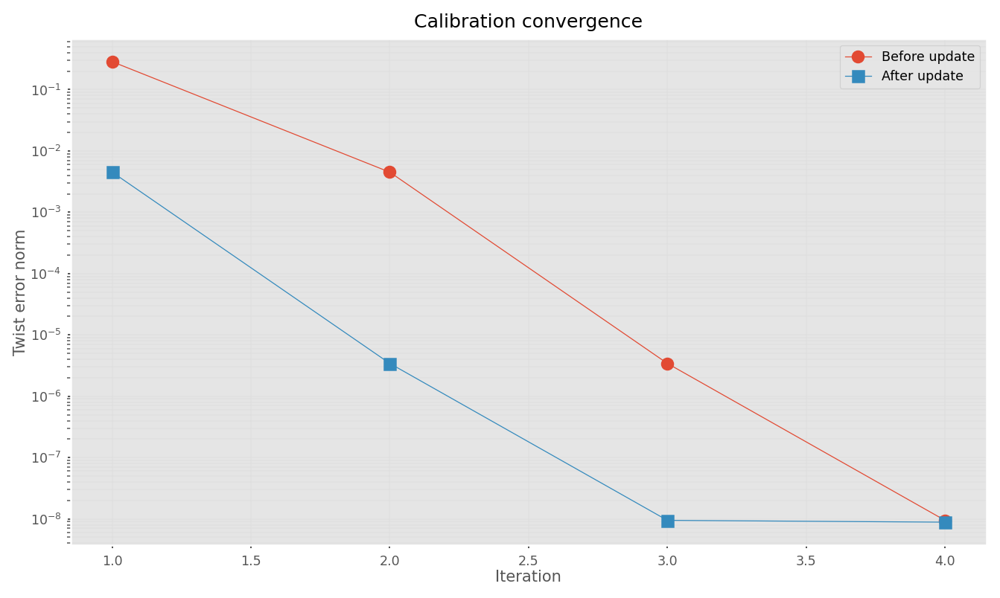
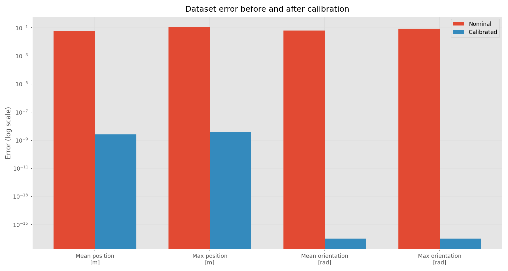
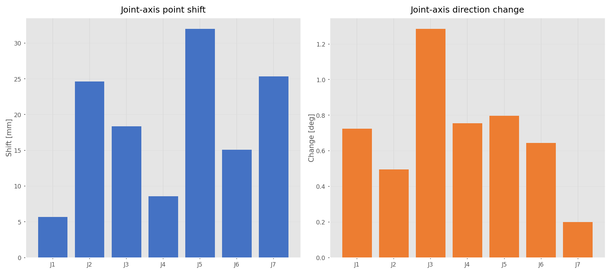
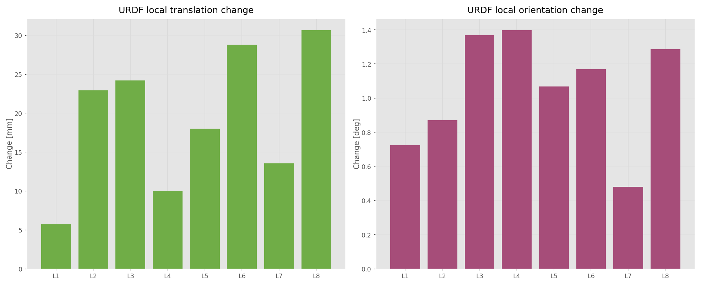

# Panda 机械臂运动学标定报告

## 1. 标定概况

| 项目 | 结果 |
|---|---:|
| 机器人模型 | Franka Panda |
| 标定末端 | `panda_link8` |
| 关节数 | 7 |
| 观测数 | 10 |
| 观测类型 | 完整 SE(3) 位姿 |
| 待估参数 | 34 |
| 终止原因 | `converged` |
| 迭代次数 | 4 |
| 最终 twist 误差范数 | 8.832049e-09 |
| 回归矩阵秩 | 34/34 |
| 条件数 | 3.064929e+01 |

## 2. 收敛过程



每轮更新均降低了 twist 残差，最终误差达到数值精度量级。本数据为无噪声仿真数据，不能将该误差水平直接视为真实机器人的可达精度。

## 3. 标定前后末端误差



| 指标 | 名义模型 | 标定后模型 |
|---|---:|---:|
| 平均位置误差 [m] | 5.656636e-02 | 2.656028e-09 |
| 最大位置误差 [m] | 1.169498e-01 | 3.769683e-09 |
| 平均姿态误差 [rad] | 6.321331e-02 | 0.000000e+00 |
| 最大姿态误差 [rad] | 8.841659e-02 | 0.000000e+00 |

## 4. 关节轴参数变化



| 关节 | 轴点位移 [mm] | 轴方向变化 [deg] | `||ΔS||` |
|---|---:|---:|---:|
| J1 | 5.694103 | 0.723490 | 1.385168e-02 |
| J2 | 24.612210 | 0.495733 | 2.625231e-02 |
| J3 | 18.354230 | 1.284519 | 2.897364e-02 |
| J4 | 8.563103 | 0.754111 | 1.791886e-02 |
| J5 | 31.975378 | 0.796254 | 3.486482e-02 |
| J6 | 15.094269 | 0.644191 | 1.594938e-02 |
| J7 | 25.333865 | 0.199953 | 2.557483e-02 |

## 5. 零位末端姿态变化

| 指标 | 数值 |
|---|---:|
| 平移变化 [mm] | 28.293118 |
| 姿态变化 [deg] | 1.197526 |

标定后的零位末端齐次变换：

```text
    [ 0.9997816617 -0.0024854159 -0.0207473281  0.0790284327]
    [-2.4773837954e-03 -9.9999684607e-01  4.1283088552e-04  1.3679486960e-03]
    [-2.0748288691e-02 -3.6134165437e-04 -9.9978466579e-01  9.2581710674e-01]
    [0. 0. 0. 1.]
```

## 6. 标定后的 POE 螺旋轴

| 关节 | `[v_x, v_y, v_z, w_x, w_y, w_z]` |
|---|---|
| J1 | `[-3.1915343330e-03, 4.7150813290e-03, 7.0195796103e-05, 4.6473924996e-03, -1.1740600700e-02, 9.9992027684e-01]` |
| J2 | `[-3.4290480815e-01, 2.9700104964e-03, -2.2525492988e-02, 8.6506255514e-03, 9.9996257016e-01, 1.5796477144e-04]` |
| J3 | `[1.7270737491e-02, 6.2127166946e-03, -3.9202258721e-05, 9.5627944511e-03, -2.0275205119e-02, 9.9974870293e-01]` |
| J4 | `[6.5447383788e-01, 8.6665010486e-03, -7.5958894649e-02, 1.3009199057e-02, -9.9991338577e-01, -1.9954209727e-03]` |
| J5 | `[3.0333808528e-03, 3.1830984961e-02, 1.0866586469e-04, 1.3091802218e-02, -4.6611122370e-03, 9.9990343471e-01]` |
| J6 | `[1.0318046541e+00, -4.2284014446e-03, -1.0424246643e-02, -3.9916172120e-03, -9.9993679526e-01, 1.0510589060e-02]` |
| J7 | `[2.5823213213e-03, 1.1320100933e-01, -3.6526079768e-04, 1.2577045077e-03, -3.2553276050e-03, -9.9999391049e-01]` |

## 7. URDF 局部变换变化



图中 `L1`～`L8` 按下表顺序对应相邻 link 变换。

| 变换 | 平移变化 [mm] | 姿态变化 [deg] |
|---|---:|---:|
| panda_link0-panda_link1 | 5.694106 | 0.723490 |
| panda_link1-panda_link2 | 22.926242 | 0.870071 |
| panda_link2-panda_link3 | 24.185431 | 1.369101 |
| panda_link3-panda_link4 | 10.006562 | 1.397641 |
| panda_link4-panda_link5 | 18.003165 | 1.068494 |
| panda_link5-panda_link6 | 28.813065 | 1.170841 |
| panda_link6-panda_link7 | 13.540841 | 0.479907 |
| panda_link7-panda_link8 | 30.659641 | 1.285953 |

## 8. 结论与注意事项

- 求解在 4 轮后正常收敛，回归矩阵满秩。
- 当前条件数为 30.649，未表现出明显的数值病态。
- 标定后模型能够重现当前无噪声仿真观测。
- 本报告使用同一数据集进行求解和误差统计，因此展示的是拟合误差，不是独立泛化误差。
- 真实机器人应额外划分验证集，并检查相机外参、末端标定板外参、单位、时间同步、机械柔性和回差。
- 将结果写入 URDF 前应备份名义模型，并在独立数据上验证标定后的正运动学。
